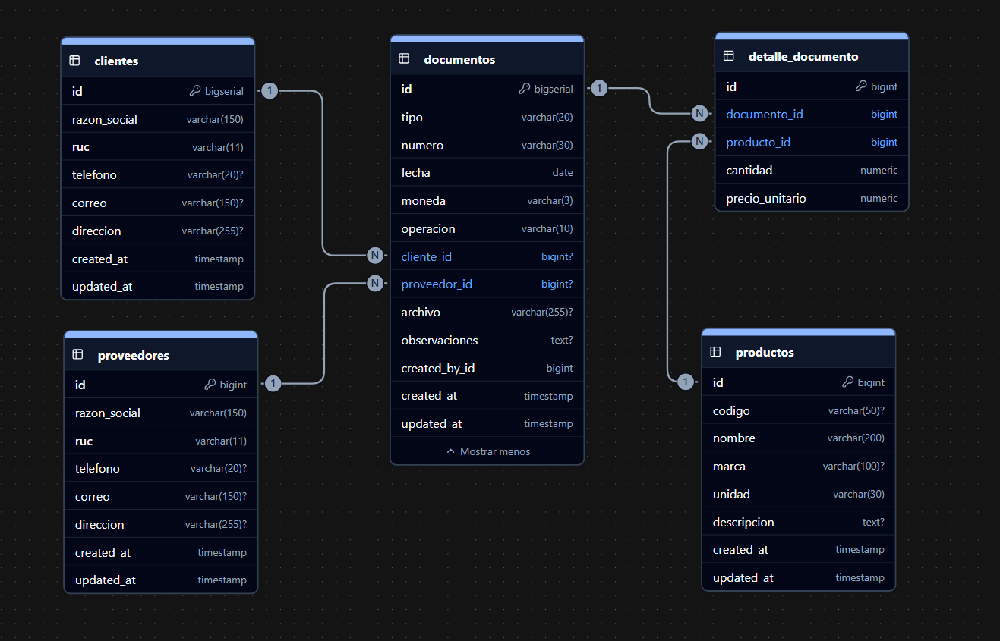

# Sistema de Gestión Comercial

Sistema web para la gestión comercial de clientes, proveedores, productos y documentos de compra y venta.

El proyecto cuenta con un backend desarrollado con Django y Django REST Framework, autenticación mediante JWT, base de datos PostgreSQL y documentación de la API mediante Swagger/OpenAPI.

---

## 🚀 Características

- 🔐 Autenticación de usuarios mediante JWT
- 👥 Gestión de clientes
- 🏢 Gestión de proveedores
- 📦 Gestión de productos
- 🧾 Gestión de documentos comerciales
- 🛒 Registro de compras
- 💰 Registro de ventas
- 📋 Gestión del detalle de documentos
- 🔎 Visor global de productos
- 📊 Consulta de compras y ventas por producto
- 📖 Documentación de API mediante Swagger
- 🗄️ Base de datos PostgreSQL
- ☁️ Despliegue preparado para Render

---

## 🛠️ Tecnologías utilizadas

### Backend

- Python
- Django
- Django REST Framework
- Simple JWT
- drf-spectacular
- PostgreSQL
- psycopg
- Gunicorn

### Frontend

- HTML5
- CSS3
- JavaScript
- Lucide Icons

### Despliegue

- Render
- PostgreSQL

---

## 📁 Estructura del proyecto

```text
sistema-gestion-comercial/
│
├── clientes/
│
├── proveedores/
│
├── productos/
│
├── documentos/
│
├── detalle_documento/
│
├── usuarios/
│
├── core/
│   ├── settings.py
│   ├── urls.py
│   ├── wsgi.py
│   └── ...
│
├── frontend/
│   ├── index.html
│   ├── login.html
│   ├── clientes.html
│   ├── proveedores.html
│   ├── productos.html
│   ├── documentos.html
│   ├── documentos.js
│   └── css/
│
├── manage.py
├── requirements.txt
└── README.md

---

## 🗄️ Diagrama de base de datos

El sistema utiliza PostgreSQL como base de datos.

El modelo está compuesto por las entidades principales de clientes, proveedores, productos, documentos y detalle de documentos.

